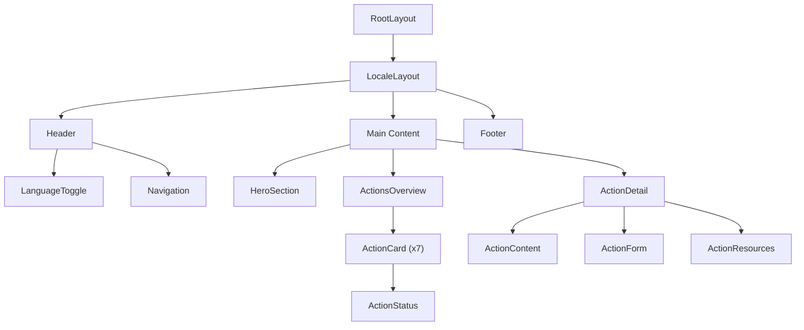

# UrgenceIA - Implementation Documentation

## Table of Contents

1. [Project Overview](#project-overview)
2. [Repository Structure](#repository-structure)
3. [Technology Stack](#technology-stack)
4. [Phase 1 - MVP Implementation](#phase-1---mvp-implementation)
5. [Phase 2 - Extended Features](#phase-2---extended-features)
6. [Translation System](#translation-system)
7. [Design System](#design-system)
8. [Deployment Strategy](#deployment-strategy)
9. [Development Timeline](#development-timeline)
10. [Future Considerations](#future-considerations)

---

## Project Overview

**UrgenceIA** is a bilingual (French/English) advocacy platform for Quebec's digital and cultural sovereignty regarding AI. The platform aims to mobilize researchers and the cultural community to take concrete actions against algorithmic pillaging of Quebec's cultural data.

### Mission Statement
- Protect Quebec's digital sovereignty
- Mobilize against unauthorized AI training on Quebec cultural data
- Implement the 7-point action plan for AI resistance
- Create a coalition of citizens, artists, lawyers, and experts

### Key Messaging
- **French**: "Urgence IA - Pour la souveraineté culturelle francophone"
- **English**: "AI Emergency - For Francophone Cultural Sovereignty"

---

## Repository Structure

```
urgenceia/
├── README.md
├── .gitignore
├── docs/
│   ├── implementation.md
│   ├── translation.md
│   ├── stripe.md
│   └── loi25.md
└── app/
    ├── package.json
    ├── next.config.js
    ├── tailwind.config.js
    ├── tsconfig.json
    ├── .env.local
    ├── .env.example
    ├── README.md
    ├── public/
    │   ├── favicon.ico
    │   ├── logo-urgenceia.svg
    │   └── images/
    ├── src/
    │   ├── app/
    │   │   ├── [locale]/
    │   │   │   ├── layout.tsx
    │   │   │   ├── page.tsx
    │   │   │   ├── actions/
    │   │   │   │   ├── page.tsx
    │   │   │   │   └── [actionId]/
    │   │   │   │       └── page.tsx
    │   │   │   └── about/
    │   │   │       └── page.tsx
    │   │   ├── globals.css
    │   │   └── layout.tsx
    │   ├── components/
    │   │   ├── ui/
    │   │   ├── layout/
    │   │   │   ├── Header.tsx
    │   │   │   ├── Footer.tsx
    │   │   │   └── LanguageToggle.tsx
    │   │   ├── sections/
    │   │   │   ├── HeroSection.tsx
    │   │   │   ├── ActionsOverview.tsx
    │   │   │   └── ActionProgress.tsx
    │   │   ├── actions/
    │   │   │   ├── ActionCard.tsx
    │   │   │   ├── ActionDetail.tsx
    │   │   │   ├── ActionForm.tsx
    │   │   │   ├── ActionContent.tsx
    │   │   │   └── ActionStatus.tsx
    │   │   └── common/
    │   ├── contexts/
    │   │   └── TranslationContext.tsx
    │   ├── translations/
    │   │   ├── index.ts
    │   │   ├── fr.ts
    │   │   └── en.ts
    │   ├── lib/
    │   │   ├── utils.ts
    │   │   └── actions.ts
    │   ├── data/
    │   │   ├── actions.ts
    │   │   └── content/
    │   │       ├── action1-loi25.md
    │   │       ├── action2-taxe.md
    │   │       ├── action3-economie.md
    │   │       ├── action4-plateformes.md
    │   │       ├── action5-badge.md
    │   │       ├── action6-ia-locales.md
    │   │       └── action7-identite.md
    │   └── types/
    │       ├── index.ts
    │       └── actions.ts
    └── middleware.ts
```

---

## Technology Stack

### Core Technologies
- **Framework**: Next.js 14 (App Router)
- **Language**: TypeScript
- **Styling**: Tailwind CSS
- **Deployment**: Vercel

### Phase 1 Dependencies
```json
{
  "dependencies": {
    "next": "^14.0.0",
    "react": "^18.0.0",
    "react-dom": "^18.0.0",
    "typescript": "^5.0.0"
  },
  "devDependencies": {
    "@types/node": "^20.0.0",
    "@types/react": "^18.0.0",
    "@types/react-dom": "^18.0.0",
    "autoprefixer": "^10.0.0",
    "eslint": "^8.0.0",
    "eslint-config-next": "^14.0.0",
    "postcss": "^8.0.0",
    "tailwindcss": "^3.0.0"
  }
}
```

### Phase 2 Additional Dependencies
```json
{
  "dependencies": {
    "firebase": "^10.0.0",
    "stripe": "^14.8.0",
    "@stripe/stripe-js": "^2.2.0",
    "@stripe/react-stripe-js": "^2.4.0"
  }
}
```

---

## Phase 1 - MVP Implementation

## Phase 1 - MVP Implementation

### 1. Core Features

#### 1.1 Bilingual Landing Page
- Hero section with compelling call-to-action
- French/English language toggle
- Actions overview with status indicators
- Showcase Action #6 (Loi 25) as "ready" status
- Preview of 6 other actions as "coming soon"

#### 1.2 Action-Based Architecture
- Dynamic action system with 7 predefined actions
- Individual action pages with conditional content
- Status-based rendering (ready/coming-soon/in-progress/completed)
- Reusable components for easy action addition

#### 1.3 Open Letter Integration
- Full display of the Loi 25 open letter within Action #6
- CyberImpact form integration for signatures
- Bilingual form handling (French/English groups)
- Generic form component for future actions

#### 1.4 Translation System
- URL-based routing: `/fr/` and `/en/`
- React Context for translation management
- Complete bilingual content coverage
- Action-specific URL mapping for SEO

### 2. Actions-Based Architecture

#### 2.1 Action Data Structure

```typescript
// types/actions.ts
export type ActionStatus = 'ready' | 'coming-soon' | 'in-progress' | 'completed';

export interface Action {
  id: number;
  slug: string;
  status: ActionStatus;
  title: { fr: string; en: string };
  description: { fr: string; en: string };
  shortDescription: { fr: string; en: string };
  content?: {
    text?: { fr: string; en: string };
    letter?: { fr: string; en: string };
    form?: ActionForm;
    resources?: ActionResource[];
  };
  meta: {
    difficulty: 'easy' | 'medium' | 'hard';
    timeframe: string;
    impact: 'local' | 'regional' | 'national' | 'international';
    category: 'legal' | 'technical' | 'economic' | 'political';
  };
}

export interface ActionForm {
  type: 'cyberimpact' | 'custom' | 'external';
  config: {
    frenchGroupId?: string;
    englishGroupId?: string;
    accountId?: string;
    customFields?: FormField[];
  };
}

export interface ActionResource {
  title: { fr: string; en: string };
  type: 'pdf' | 'link' | 'video' | 'document';
  url: string;
  description?: { fr: string; en: string };
}
```

#### 2.2 Component Architecture



#### 2.3 Actions Data Configuration

```typescript
// data/actions.ts
export const actions: Action[] = [
  {
    id: 1,
    slug: 'ia-locales',
    status: 'coming-soon',
    title: {
      fr: 'Créer nos propres IA locales',
      en: 'Create our own local AI'
    },
    description: {
      fr: 'Former un grand modèle francophone entraîné sur des corpus culturels québécois',
      en: 'Train a large francophone model on Quebec cultural corpus'
    },
    // ... full configuration
  },
  {
    id: 6,
    slug: 'loi-25',
    status: 'ready',
    title: {
      fr: 'Exploiter les lois existantes (Loi 25, RGPD)',
      en: 'Leverage existing laws (Law 25, GDPR)'
    },
    description: {
      fr: 'Utiliser pleinement les cadres juridiques actuels pour exiger le consentement explicite',
      en: 'Fully utilize current legal frameworks to require explicit consent'
    },
    content: {
      letter: {
        fr: '/* Loi 25 open letter content */',
        en: '/* Law 25 open letter content */'
      },
      form: {
        type: 'cyberimpact',
        config: {
          frenchGroupId: '5',
          englishGroupId: '2',
          accountId: '4eafd57b-a9ce-4713-31b5-9b4ec3d86605'
        }
      }
    },
    meta: {
      difficulty: 'medium',
      timeframe: 'immediate',
      impact: 'national',
      category: 'legal'
    }
  },
  // ... other actions with status: 'coming-soon'
];
```

#### 2.4 Key Components

**HeroSection.tsx**
- Compelling headline: "Urgence IA"
- Subtitle: "Pour la souveraineté culturelle francophone"
- Call-to-action button leading to actions overview
- Modern, attention-grabbing design

**ActionsOverview.tsx**
- Grid display of all 7 actions
- Action status indicators (ready/coming-soon)
- Progress tracking visualization
- Quick action descriptions

**ActionCard.tsx**
- Individual action preview
- Status badge and difficulty indicator
- Click-through to detailed action page
- Responsive card design

**ActionDetail.tsx**
- Full action page layout
- Dynamic content rendering based on action data
- Conditional form display
- Resource links and downloads

**ActionForm.tsx**
- Generic form component
- CyberImpact integration for ready actions
- Coming soon placeholders
- Bilingual field handling

**ActionContent.tsx**
- Markdown content renderer
- Letter display for legal actions
- Rich text formatting
- Citation and reference handling

**ActionStatus.tsx**
- Visual status indicators
- Progress tracking
- Timeline information
- Impact metrics display

### 3. Translation Implementation

#### 3.1 Middleware Configuration
```typescript
// middleware.ts
import { NextRequest, NextResponse } from 'next/server';

const locales = ['fr', 'en'];
const defaultLocale = 'fr';

export function middleware(request: NextRequest) {
  const pathname = request.nextUrl.pathname;
  const pathnameIsMissingLocale = locales.every(
    (locale) => !pathname.startsWith(`/${locale}/`) && pathname !== `/${locale}`
  );

  if (pathnameIsMissingLocale) {
    return NextResponse.redirect(
      new URL(`/${defaultLocale}${pathname}`, request.url)
    );
  }
}

export const config = {
  matcher: [
    '/((?!api|_next/static|_next/image|favicon.ico|.*\\..*|_next).*)',
  ],
};
```

#### 3.2 Translation Structure
```typescript
// translations/fr.ts
export const fr = {
  site: {
    title: "UrgenceIA",
    description: "Pour la souveraineté culturelle francophone",
    tagline: "Agir maintenant contre le pillage algorithmique"
  },
  hero: {
    title: "Urgence IA",
    subtitle: "Pour la souveraineté culturelle francophone",
    description: "Les géants technologiques utilisent nos données culturelles pour entraîner leurs IA sans notre consentement. Il est temps d'agir.",
    cta: "Signer la lettre ouverte"
  },
  letter: {
    title: "Loi 25 : Exploiter les lois existantes",
    subtitle: "Une lettre ouverte pour protéger nos données",
    readMore: "Lire la lettre complète",
    sign: "Co-signer cette lettre"
  },
  form: {
    firstName: "Prénom",
    lastName: "Nom",
    company: "Entreprise/Organisation",
    title: "Titre/Fonction",
    email: "Courriel",
    submit: "Signer la lettre",
    success: "Merci pour votre signature !",
    error: "Erreur lors de l'envoi. Veuillez réessayer."
  },
  actions: {
    title: "Les 7 actions pour la souveraineté numérique",
    current: "Action en cours",
    coming: "Prochainement",
    action6: {
      title: "Exploiter les lois existantes",
      description: "Utiliser la Loi 25 et le RGPD pour exiger le consentement explicite"
    }
  }
};
```

### 4. Design System Integration

#### 4.1 Global Styles (from BadgeAI.org)
```css
/* globals.css */
@tailwind base;
@tailwind components;
@tailwind utilities;

@layer base {
  :root {
    --packet-size: 32px;
  }

  body {
    @apply bg-gradient-to-b from-gray-950 via-gray-900 to-gray-950 text-gray-100;
    font-family: system-ui, -apple-system, BlinkMacSystemFont, "Segoe UI",
      Roboto, "Helvetica Neue", Arial, sans-serif;
    -webkit-font-smoothing: antialiased;
    -moz-osx-font-smoothing: grayscale;
    background-attachment: fixed;
  }

  h1, h2, h3, h4, h5, h6 {
    @apply font-semibold leading-tight mb-4 tracking-tight;
  }

  h1 {
    @apply text-3xl md:text-4xl font-bold text-white;
  }

  h2 {
    @apply text-2xl md:text-3xl text-white;
  }

  h3 {
    @apply text-xl md:text-2xl text-white;
  }

  p {
    @apply leading-relaxed mb-4 text-gray-200;
  }

  a {
    @apply text-blue-400 hover:text-blue-300 transition-colors;
  }
}

@layer components {
  .container-narrow {
    @apply w-full max-w-4xl mx-auto px-4 sm:px-6;
  }

  .card {
    @apply bg-surface-card/90 backdrop-blur-sm rounded-xl border border-white/10 shadow-soft p-6 md:p-8 transition-all duration-300 hover:shadow-glow;
  }

  .btn {
    @apply inline-flex items-center justify-center rounded-lg px-4 py-2 text-sm font-medium transition-all duration-300;
    @apply focus:outline-none focus:ring-2 focus:ring-offset-2 focus:ring-primary-500;
    @apply disabled:opacity-50 disabled:cursor-not-allowed;
    @apply transform hover:translate-y-[-2px] active:translate-y-[1px];
  }

  .btn-primary {
    @apply bg-gradient-to-r from-primary-600 to-primary-500 text-white hover:from-primary-700 hover:to-primary-600 shadow-md;
  }

  .btn-secondary {
    @apply bg-gradient-to-r from-gray-700 to-gray-600 text-white hover:from-gray-800 hover:to-gray-700 border border-gray-600 shadow-md;
  }

  .btn-outline {
    @apply bg-transparent backdrop-blur-sm border border-gray-600 text-gray-200 hover:bg-gray-800/50 shadow-sm;
  }

  .glass-panel {
    @apply bg-white/5 backdrop-blur-md border border-white/10 rounded-xl shadow-soft;
  }

  .animated-gradient-text {
    @apply font-bold text-transparent bg-clip-text;
    background-image: linear-gradient(90deg, #3b82f6, #4f46e5, #7c3aed, #3b82f6);
    background-size: 300% 100%;
    animation: textGradientAnimation 8s linear infinite;
  }

  @keyframes textGradientAnimation {
    0% { background-position: 0% 50%; }
    50% { background-position: 100% 50%; }
    100% { background-position: 0% 50%; }
  }

  .hover-lift {
    @apply transition-all duration-300 transform hover:translate-y-[-5px] hover:shadow-glow;
  }
}
```

#### 4.2 Tailwind Configuration
```javascript
// tailwind.config.js
module.exports = {
  content: [
    './src/pages/**/*.{js,ts,jsx,tsx,mdx}',
    './src/components/**/*.{js,ts,jsx,tsx,mdx}',
    './src/app/**/*.{js,ts,jsx,tsx,mdx}',
  ],
  theme: {
    extend: {
      colors: {
        primary: {
          50: '#eff6ff',
          500: '#3b82f6',
          600: '#2563eb',
          700: '#1d4ed8',
        },
        'surface-card': 'rgba(255, 255, 255, 0.05)',
      },
      boxShadow: {
        'soft': '0 4px 6px -1px rgba(0, 0, 0, 0.1), 0 2px 4px -1px rgba(0, 0, 0, 0.06)',
        'glow': '0 10px 25px -3px rgba(59, 130, 246, 0.5), 0 4px 6px -2px rgba(59, 130, 246, 0.25)',
      },
    },
  },
  plugins: [],
};
```

### 5. CyberImpact Form Integration

#### 5.1 SignatureForm Component
```typescript
// components/sections/SignatureForm.tsx
import { useTranslation } from '@/contexts/TranslationContext';

export default function SignatureForm() {
  const { t, language } = useTranslation();
  
  const formAction = "https://app.cyberimpact.com/optin";
  const groupId = language === 'fr' ? '5' : '2'; // French: 5, English: 2
  const accountId = "4eafd57b-a9ce-4713-31b5-9b4ec3d86605";
  const languageCode = language === 'fr' ? 'fr_ca' : 'en_ca';

  return (
    <div className="card">
      <h3 className="text-2xl font-bold mb-6">{t('form.title')}</h3>
      
      <form action={formAction} method="post" acceptCharset="utf-8" className="space-y-4">
        <div className="grid md:grid-cols-2 gap-4">
          <div>
            <label htmlFor="ci_firstname" className="block text-sm font-medium mb-2">
              {t('form.firstName')} *
            </label>
            <input
              type="text"
              id="ci_firstname"
              name="ci_firstname"
              maxLength={255}
              required
              className="w-full p-3 rounded-lg bg-gray-800/50 border border-gray-600 text-white focus:border-primary-500 focus:ring-1 focus:ring-primary-500"
            />
          </div>
          
          <div>
            <label htmlFor="ci_lastname" className="block text-sm font-medium mb-2">
              {t('form.lastName')} *
            </label>
            <input
              type="text"
              id="ci_lastname"
              name="ci_lastname"
              maxLength={255}
              required
              className="w-full p-3 rounded-lg bg-gray-800/50 border border-gray-600 text-white focus:border-primary-500 focus:ring-1 focus:ring-primary-500"
            />
          </div>
        </div>

        <div>
          <label htmlFor="ci_company" className="block text-sm font-medium mb-2">
            {t('form.company')}
          </label>
          <input
            type="text"
            id="ci_company"
            name="ci_company"
            maxLength={255}
            className="w-full p-3 rounded-lg bg-gray-800/50 border border-gray-600 text-white focus:border-primary-500 focus:ring-1 focus:ring-primary-500"
          />
        </div>

        <div>
          <label htmlFor="ci_note" className="block text-sm font-medium mb-2">
            {t('form.title')}
          </label>
          <input
            type="text"
            id="ci_note"
            name="ci_note"
            className="w-full p-3 rounded-lg bg-gray-800/50 border border-gray-600 text-white focus:border-primary-500 focus:ring-1 focus:ring-primary-500"
          />
        </div>

        <div>
          <label htmlFor="ci_email" className="block text-sm font-medium mb-2">
            {t('form.email')} *
          </label>
          <input
            type="email"
            id="ci_email"
            name="ci_email"
            maxLength={255}
            required
            className="w-full p-3 rounded-lg bg-gray-800/50 border border-gray-600 text-white focus:border-primary-500 focus:ring-1 focus:ring-primary-500"
          />
        </div>

        {/* Hidden fields for CyberImpact */}
        <div style={{ display: 'block', visibility: 'hidden', height: '1px' }}>
          <input type="hidden" id="ci_groups" name="ci_groups" value={groupId} />
          <input type="hidden" id="ci_account" name="ci_account" value={accountId} />
          <input type="hidden" id="ci_language" name="ci_language" value={languageCode} />
          <input type="hidden" id="ci_sent_url" name="ci_sent_url" value="" />
          <input type="hidden" id="ci_error_url" name="ci_error_url" value="" />
          <input type="hidden" id="ci_confirm_url" name="ci_confirm_url" value="" />
        </div>

        <button
          type="submit"
          className="btn btn-primary w-full py-4 text-lg font-semibold"
          aria-label={t('form.submit')}
        >
          {t('form.submit')}
        </button>
      </form>
    </div>
  );
}
```

---

## Phase 2 - Extended Features

### 1. Additional Actions (2-7)
- Progressive revelation of the remaining 6 actions
- Individual landing pages for each action
- Action-specific forms and resources

### 2. Firebase Integration

#### 2.1 Authentication System
```typescript
// Firebase configuration
const firebaseConfig = {
  // Configuration will be added during Phase 2
};

// Authentication providers
- Email/Password authentication
- Google OAuth (optional)
- Admin role management
```

#### 2.2 File Management System
```typescript
// Firestore collections structure
collections = {
  users: {
    uid: string,
    email: string,
    displayName: string,
    role: 'user' | 'admin',
    verified: boolean,
    createdAt: timestamp
  },
  documents: {
    id: string,
    title: string,
    description: string,
    fileUrl: string,
    actionId: number, // 1-7 for the actions
    uploadedBy: string, // user uid
    approved: boolean,
    createdAt: timestamp
  },
  blogPosts: {
    id: string,
    title: { fr: string, en: string },
    content: { fr: string, en: string },
    slug: { fr: string, en: string },
    authorId: string,
    published: boolean,
    createdAt: timestamp,
    updatedAt: timestamp
  }
}
```

### 3. Blog System

#### 3.1 Content Management Recommendations
**Option 1: Firebase + Markdown**
- Store blog posts in Firestore
- Use markdown for content formatting
- Admin interface for CRUD operations
- Version control for drafts

**Option 2: Firebase + Rich Text Editor**
- Firestore for storage
- Rich text editor (TinyMCE, Quill.js)
- Media management for images
- SEO-friendly URL structure

**Recommendation**: Option 1 (Markdown) for simplicity and developer-friendly workflow.

#### 3.2 Blog Features
- Bilingual post management
- SEO optimization
- RSS feed generation
- Social media sharing
- Comment system (optional for later phases)

### 4. Stripe Integration

#### 4.1 Donation System
- One-time donations
- Monthly recurring donations
- Multiple currency support (CAD primary)
- Donation tracking and receipts
- Integration with accounting systems

#### 4.2 Implementation
```typescript
// Stripe configuration
- Product: "UrgenceIA Donation"
- Currencies: CAD (primary), USD
- Payment methods: Cards, Google Pay, Apple Pay
- Webhooks for payment confirmation
- Donor management system
```

### 5. Admin Dashboard

#### 5.1 User Management
- User role assignment (admin/user)
- Account verification system
- Access control for document uploads
- Activity monitoring

#### 5.2 Content Management
- Blog post approval workflow
- Document review and publishing
- User-generated content moderation
- Analytics integration

---

## Translation System

### 1. URL Structure
- Default language: French (`/fr/`)
- Secondary language: English (`/en/`)
- Automatic redirect from root to `/fr/`
- Language detection based on URL

### 2. Implementation Pattern
```typescript
// Route structure
/fr/                    -> French homepage
/en/                    -> English homepage
/fr/lettre-ouverte     -> French open letter
/en/open-letter        -> English open letter
/fr/actions            -> French actions list
/en/actions            -> English actions list
```

### 3. Translation Context
- React Context for global state management
- Persistent language selection
- Dynamic content switching
- SEO-friendly meta tags per language

---

## Design System

### 1. Visual Identity

#### 1.1 Color Palette
- **Primary**: Blue gradient (#3b82f6 to #4f46e5)
- **Background**: Dark gradient (gray-950 to gray-900)
- **Text**: White/gray-100 for primary, gray-200 for secondary
- **Accent**: Purple (#7c3aed) for highlights

#### 1.2 Typography
- **Primary Font**: System UI stack
- **Headings**: Semibold, tight tracking
- **Body**: Regular weight, relaxed leading
- **Emphasis**: Gradient text animations

#### 1.3 Components
- **Cards**: Glass morphism with backdrop blur
- **Buttons**: Gradient backgrounds with hover lift
- **Forms**: Dark theme with blue focus states
- **Navigation**: Clean, minimal approach

### 2. Responsive Design
- **Mobile-first** approach
- **Breakpoints**: sm (640px), md (768px), lg (1024px), xl (1280px)
- **Container**: Max-width 4xl (896px) for content
- **Grid**: CSS Grid and Flexbox for layouts

### 3. Accessibility
- **WCAG 2.1 AA** compliance
- **Keyboard navigation** support
- **Screen reader** optimization
- **High contrast** color schemes
- **Focus indicators** on all interactive elements

---

## Deployment Strategy

### 1. Vercel Configuration

#### 1.1 Build Settings
```javascript
// next.config.js
module.exports = {
  output: 'standalone',
  images: {
    domains: ['firebasestorage.googleapis.com'], // Phase 2
  },
  i18n: {
    locales: ['fr', 'en'],
    defaultLocale: 'fr',
  },
  async redirects() {
    return [
      {
        source: '/',
        destination: '/fr',
        permanent: true,
      },
    ];
  },
};
```

#### 1.2 Environment Variables
```bash
# Phase 1 - Not needed

# Phase 2 - Firebase
NEXT_PUBLIC_FIREBASE_API_KEY=
NEXT_PUBLIC_FIREBASE_AUTH_DOMAIN=
NEXT_PUBLIC_FIREBASE_PROJECT_ID=
NEXT_PUBLIC_FIREBASE_STORAGE_BUCKET=
NEXT_PUBLIC_FIREBASE_MESSAGING_SENDER_ID=
NEXT_PUBLIC_FIREBASE_APP_ID=

# Phase 2 - Stripe
STRIPE_SECRET_KEY=
NEXT_PUBLIC_STRIPE_PUBLISHABLE_KEY=
NEXT_PUBLIC_BASE_URL=

# Phase 2 - Analytics
NEXT_PUBLIC_VERCEL_ANALYTICS_ID=
```

### 2. Domain Configuration
- **Primary**: urgenceia.org (French default)
- **Aliases**: urgenceia.com, ai-emergency.org
- **SSL**: Automatic via Vercel
- **CDN**: Global edge network

### 3. Performance Optimization
- **Image optimization**: Next.js Image component
- **Code splitting**: Automatic route-based splitting
- **Caching**: Static generation where possible
- **Analytics**: Vercel Analytics integration

---

## Development Timeline

### Phase 1 - MVP (2-3 weeks)

#### Week 1: Foundation
- [ ] Repository setup and initial configuration
- [ ] Next.js app with TypeScript and Tailwind
- [ ] Translation system implementation
- [ ] Basic routing structure (/fr/, /en/)
- [ ] Design system setup (BadgeAI.org styles)

#### Week 2: Core Features
- [ ] Hero section with compelling messaging
- [ ] Open letter display component
- [ ] CyberImpact form integration
- [ ] Language toggle functionality
- [ ] Responsive design implementation

#### Week 3: Polish & Deploy
- [ ] Content writing and translation
- [ ] SEO optimization and meta tags
- [ ] Accessibility testing and fixes
- [ ] Vercel deployment configuration
- [ ] Domain setup and SSL

### Phase 2 - Extended Features (4-6 weeks)

#### Weeks 4-5: Authentication & Firebase
- [ ] Firebase project setup
- [ ] User authentication system
- [ ] Admin dashboard basics
- [ ] File upload infrastructure

#### Weeks 6-7: Additional Actions
- [ ] Actions 2-7 landing pages
- [ ] Action-specific forms and resources
- [ ] Document management system

#### Weeks 8-9: Blog System
- [ ] Blog infrastructure (Firebase + Markdown)
- [ ] Admin blog management interface
- [ ] SEO and RSS implementation

#### Week 10: Stripe & Polish
- [ ] Stripe donation system
- [ ] Final testing and optimization
- [ ] Performance audits
- [ ] User acceptance testing

---

## Future Considerations

### 1. Scalability Planning
- **Database**: Firestore scaling for high volume
- **CDN**: Global content distribution
- **Caching**: Redis for session management
- **API**: Rate limiting and authentication

### 2. SEO & Marketing
- **Meta tags**: Comprehensive OpenGraph and Twitter Cards
- **Structured data**: Schema.org markup
- **Sitemap**: Automatic generation
- **Analytics**: Google Analytics 4 integration

### 3. Security Measures
- **Authentication**: Firebase Security Rules
- **Data validation**: Server-side validation
- **XSS protection**: Content sanitization
- **CSRF protection**: Token-based protection

### 4. Monitoring & Analytics
- **Error tracking**: Sentry integration
- **Performance**: Vercel Analytics + Web Vitals
- **User analytics**: Privacy-respecting analytics
- **Uptime monitoring**: Automated alerts

### 5. Content Strategy
- **Blog topics**: AI ethics, Quebec sovereignty, legal updates
- **Guest contributors**: Researchers, lawyers, artists
- **Social media**: Cross-platform content sharing
- **Newsletter**: Regular updates via CyberImpact

---

## Technical Decision Rationale

### 1. Why Next.js 14 (App Router)
- **Performance**: Excellent build optimization and caching
- **SEO**: Server-side rendering for better search visibility
- **Internationalization**: Built-in i18n support
- **Developer Experience**: Great TypeScript integration

### 2. Why Tailwind CSS
- **Rapid development**: Utility-first approach
- **Consistency**: Design system constraints
- **Performance**: Minimal CSS bundle size
- **Maintainability**: Clear, readable component styles

### 3. Why Firebase (Phase 2)
- **Scalability**: Google Cloud infrastructure
- **Real-time features**: Live updates for collaborative features
- **Authentication**: Comprehensive auth providers
- **Cost-effective**: Pay-as-you-scale pricing

### 4. Why CyberImpact Integration
- **Existing infrastructure**: Already available
- **GDPR compliance**: Built-in privacy features
- **Email automation**: Newsletter and follow-ups
- **Cost-effective**: No additional service costs

---

**This implementation document serves as a comprehensive guide for building UrgenceIA from concept to production deployment. The phased approach ensures rapid time-to-market while maintaining high quality and scalability for future growth.**